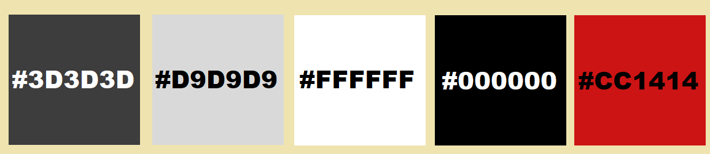
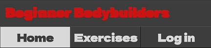
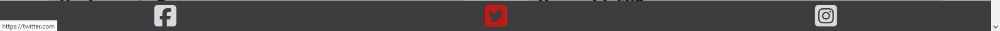
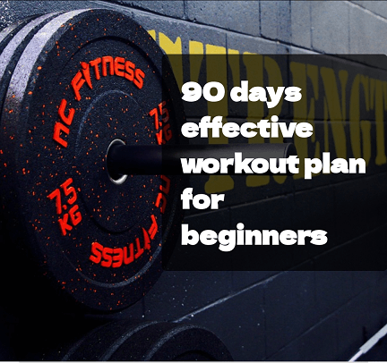
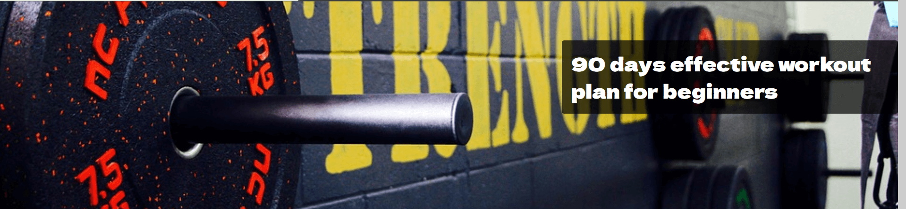
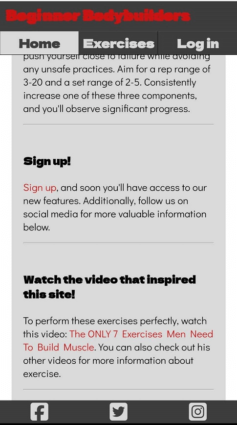
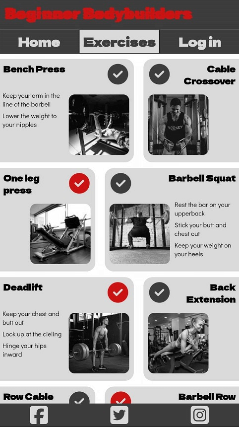
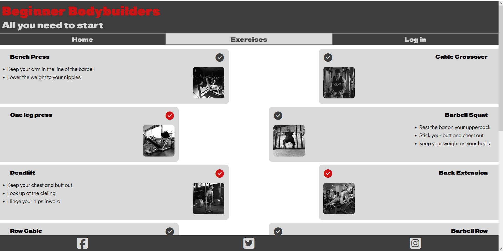
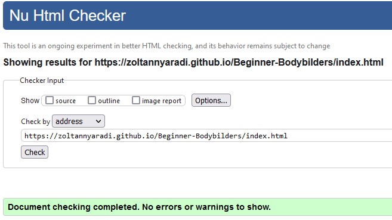
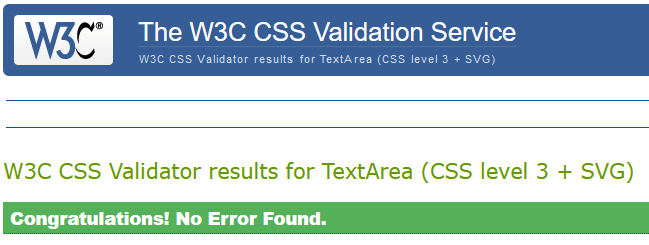

# Beginner Budybuilder 

The Beginner Bodybuilders site is designed as a helpful tool for anyone planning to start working out. The concise advice and workout plan prevent exhaustion from the overwhelming amount of information before hitting the gym. Its main function is to help you track your workout progress.

Start a healthier life now and try it for yourself: [Beginner Budybuilder ](https://zoltannyaradi.github.io/Beginner-Bodybilders/)

## Contents

* [Designe](#designe)
  * [Color Scheme](#color-scheme)
  * [Typography](#typography)
*   [Wireframe](#wireframe)
* [Features](#features)
  * [Favicon](#favicon)
  * [Header](#header)
  * [Footer](#footer)
  * [Hero section](#hero-section)
  * [Content section](#content-section)
  * [Exercise page](#exercise-page)
  * [Log In page](#log-in-page)
  * [Thank You page](#thank-you-page)
  * [Future Implementions](#future-implementions)
* [Technologies Used](#technologies-used)
  * [Languages Used](#languages-used)
  * [Used Programs](#used-programs)
* [Deployment & Local Development](#deployment--local-development)
  * [Deployment](#deployment)
  * [Local Development](#local-development)
    * [How to Fork](#how-to-fork)
    * [How to Clone](#how-to-clone)
* [Testing](#testing)
  * [HTML validator](#html-validator)
  * [CSS validator](#css-validator)
  * [Google Lighthouse](#google-lighthouse)
  * [Solved Bugs](#solved-bugs)
  * [Manual Testing](#manual-testing)
* [Credits](#credits)
  * [Used Code](#used-code)
  * [Content](#content)
    * [Images](#images)
  * [README](#readme)
  * [Acknowledgments](#acknowledgments)

## Designe

### Color Scheme

Five colors were used throughout the site, inspired by the gym where I work out: Fitness. The combination of black, grey, and white, accented with a touch of red, keeps it simple yet appealing. The images were carefully selected to complement these colors, and on the exercise page, they were adjusted to black and white.

 * #3D3D3D was used as the primary color, serving as the background for the header and footer. 
 * #D9D9D9 is the other primary color, functioning as the font color in the header and footer, as well as the background for items in the main content.
 * #FFFFFF was used as the background behind everything when no background image was added. Additionally, the cover text was kept white for better visibility. 
 * #000000 was predominantly used for text. 
 * #CC1414 is the color for the largest texts and is employed for the hover function in the footer, also serving as a marker for finished exercises.

### Typography

The fonts were imported from Google Fonts.

* Rubik Glitch was used with the red color for the largest text
* Dela Gothic One was used for the subtitles.
* Didac Gothic was used for the body text.
* Verdana was used as a backup font in case the others are not working.

### Wireframe

Figma was used to create a skeleton for phones, as the targeted device for this site is intended for use in a gym. However, it appears that not all aspects of the plan were realized; more information can be found in the features section.

## Features

### Favicon

Favicon appears in Mac and Windows browsers

### Header

The header is fully responsive, with a clickable title. The subtitle is hidden on phones to ensure more content visibility. The current page features an opposite color design on the navigation bar, and when hovering over a navigation element using a laptop or PC, its background changes to red.

### Footer

The footer has a design similar to the header. The icons lead to our social media in a new tab and also have a hover function on larger devices.

### Hero section

The hero image and the cover text are fully responsive, and that the text is easily readable.

### Content section

The content has a different design on phones and tablets, with varied text placement. The 'Sign Up' text includes a link to the login page. Due to legal reasons, I couldn't insert a YouTube video directly, so I opted to include a link to the video, which opens in a new page.

### Exercise page

Here, you can find the workout plan with seven exercises in larger boxes and their alternatives in the smaller ones. If you finish an exercise, clicking the check will turn it red. On laptops and larger devices, the gap between the containers is increased, and other responsive design elements are added to both texts and images.

### Log In page

The background image scales up with the screen size while maintaining its ratio. If you fill out the form, you can sign up; otherwise, you'll receive a message indicating that you missed filling it out. Clicking the button directs you to the Thank You page. Despite appearing as the Log In page, the form is for signing up. Currently, I lack the knowledge to manage users effectively. However, in the future, this form will be switchable between log in and sign up with a checkbox. Additionally, the link on the index page with the text 'Sign Up' will automatically check it.

### Thank You page

This page features the same background image. A gracious 'thank you' message confirms your successful sign-up. The button directs you to the exercise page, where you can start your workout.

### Future Implementions

* In the future you can write your current lifting weight next to the image. So to free up space the description of the exercise is will be shown only when you click on an icon, that will be also added.
* As it was mentioned it will be possible to switch between log in and sign up form.
* The link to sign up will load the log in page, but the sign up form.
* A database will be added. The user lifting weights will be stored in a database, so they can reach it from any device.

## Technologies Used

### Languages Used

HTML and CSS

### Used Programs

* Figma - Used for creating wireframe
* Github - Used to save project
* Codeanywhere - Used as a developer platform  
* Google Fonts - Used to import forms
* iconfinder.com - Used to chose fav icon
* fontawesome.com - Used for icons
* MS Paint - Used to miniaturize images
* tinypng.com - Used to compress images
* Am I Responsive? - Used to check different view sizes
* Firefox Developer Tools  - Used to review project
* quillbot.com - Used to correct language
* ChatGTP - Used to correct language

## Deployment & Local Development

### Deployment

The site is deployed using GitHub Pages - [Beginner Bodybilders](https://zoltannyaradi.github.io/Beginner-Bodybilders/).

To Deploy the site using GitHub Pages:

1. Login (or signup) to Github.
2. Go to the repository for this project, [ZoltanNyaradi/Beginner-Bodybilders](https://github.com/ZoltanNyaradi/Beginner-Bodybilders/deployments).
3. Click the settings button.
4. Select pages in the left hand navigation menu.
5. From the source dropdown select main branch and press save.
6. The site has now been deployed, please note that this process may take a few minutes before the site goes live.

### Local Development

#### How to Fork

To fork the repository:

1. Log in (or sign up) to Github.
2. Go to the repository for this project, [ZoltanNyaradi/Beginner-Bodybilders](https://github.com/ZoltanNyaradi/Beginner-Bodybilders/deployments).
3. Click the Fork button in the top right corner.

#### How to Clone

To clone the repository:

1. Log in (or sign up) to GitHub.
2. Go to the repository for this project, [ZoltanNyaradi/Beginner-Bodybilders](https://github.com/ZoltanNyaradi/Beginner-Bodybilders/deployments).
3. Click on the code button, select whether you would like to clone with HTTPS, SSH or GitHub CLI and copy the link shown.
4. Open the terminal in your code editor and change the current working directory to the location you want to use for the cloned directory.
5. Type 'git clone' into the terminal and then paste the link you copied in step 3. Press enter.

## Testing

### HTML validator

The validator.w3.org HTML validator showed few errors like a forgotten ">" in the code, and a bottom was in an anchor element. The ">" was removed and the anchor was replaced with a form.

### CSS validator

The jigsaw.w3.org/css-validator/ CSS validator showed no error. 

### Google Lighthouse

The Lighthouse helped me also to find some mistake, such as:
* The footer icons had no accessibility names.
* Links weren't well visible in the text.
* Images were to large.
  
Compressing these images made the exercise page from the worst to the best preforming page in this site.

### Solved Bugs

|No.|Bug| Solution|
| :--- | :--- | :--- |
|1.|The exercise page fell apart, due to that the width of the boxes were in vw, and the scrollbar used up some space what made this happens.|I changed the width unit for the boxes to %.|
|2.|Similar issue happened in my phone at the top under the header. In some screen size it was to much sometime to little the margin.|I set a 10px less margin for the main margin so the images slide under the header, but never shows a gap. In the other hand I set a 10px larger top margin for the section. So the text never go under the header.|
|3.|Some text was not easily readable.|I changed the background or the font color.|
|4.|Buttons weren't vertically centralized. |I used flexblox to solve it.|
|5.|In screen size the background image on log in and thank you page had a gap between under it and the footer|I changed its height to 100vh.|
|6.|The header and the footer took up too much space on mobile.|I set to don't display the side title on phone and I reduced other elements size as well.|
|7.|The size of every elements were double as I expected on PC.|I reduced them to normal.|
|8.|In exercise page on the right side, if the name of an exercise was in two line the text was not anymore align to the right|I set an align right for these elements.|

### Manual Testing

You can find the manual testin in the [TESTING.md](TESTING.md).

## Credits

### Used Code

Writing the code, I have checked codes syntax, its properties on the Code Institute's learning material, and on www.w3schools.com.
Codes were used from the Code Institute's Love Running project. For example at the footer icon's HTML and the check box's HTML.

### Content

* A lot of idea come from the Love Running project, but these are also wildly spread standards in web development.
* The text and the plan based on the videos of the Gravity Transformation YouTube channel.
* The cover text was written by my friend Puska Richárd.

#### Images

|Site|Image|Link|
| :--- | :--- | :--- |
|pixabay.com|gym|https://cdn.pixabay.com/photo/2017/08/17/02/28/gym-2649824_960_720.jpg|
|pixabay.com|log-in|https://cdn.pixabay.com/photo/2020/05/22/19/07/fitness-5206699_640.jpg|
|pixabay.com|barbell-squat|https://pixabay.com/hu/photos/s%C3%BAlyz%C3%B3-tornaterem-%C3%A1llv%C3%A1ny-f%C3%A9rfi-3895455/|
|pixabay.com|power-clean|https://cdn.pixabay.com/photo/2016/11/19/12/43/barbell-1839087_640.jpg|
|pixabay.com|box-jump|https://pixabay.com/hu/photos/emberek-l%C3%A1ny-gyakorlat-fitness-2604151/|
|pixabay.com|lat-pulldown|https://cdn.pixabay.com/photo/2016/08/31/02/58/bodybuilding-1632549_640.jpg|
|pixabay.com|cable-crossover|https://cdn.pixabay.com/photo/2020/11/04/05/08/body-building-5711492_640.jpg|
|pixabay.com|row-cable|https://cdn.pixabay.com/photo/2020/11/04/05/08/body-building-5711492_960_720.jpg|
|pixabay.com|one-leg-press|https://cdn.pixabay.com/photo/2016/01/31/18/18/sports-1171842_640.jpg|
|stock.adobe.com|bench-press|https://t3.ftcdn.net/jpg/03/00/58/88/240_F_300588850_Tz5z4eot6yR3i0XdS9LC2jvO3JssyQRI.jpg|
|stock.adobe.com|deadlift|https://stock.adobe.com/hu/images/deadlift-exercise-man-during-his-workout-in-the-gym/212623107|
|stock.adobe.com|pull-up|https://t3.ftcdn.net/jpg/00/89/39/96/240_F_89399616_nGT5efjbiVfcoeMQlfGZqMxTmIMMrOoU.jpg|
|stock.adobe.com|shoulder-machine|https://t4.ftcdn.net/jpg/02/15/94/41/240_F_215944153_v98HOdC4nlt1Ev8LAovauF6KRzdaodAZ.jpg|
|stock.adobe.com|back-extension|https://t3.ftcdn.net/jpg/03/97/46/28/240_F_397462889_jjqbIURUEA8ybrtnadtVjFp4PTlQgmnG.jpg|
|stock.adobe.com|barbell-row|https://t4.ftcdn.net/jpg/03/83/87/65/240_F_383876592_QNz3hVUOVXRA8Gqs4Q7EObDHMtpq50eM.jpg|
|unsplash.com|shoulder-press|https://cdn0.iconfinder.com/data/icons/font-awesome-solid-vol-2/640/dumbbell-256.png|

### README

This file was created based on the [The-Quiz-Arms/README.md](https://github.com/kera-cudmore/TheQuizArms/blob/main/README.md).

### Acknowledgments

I would like to thank for the help to my mentor Jubril Akolade how suggested to create the Thank You page, and other useful improvements.

